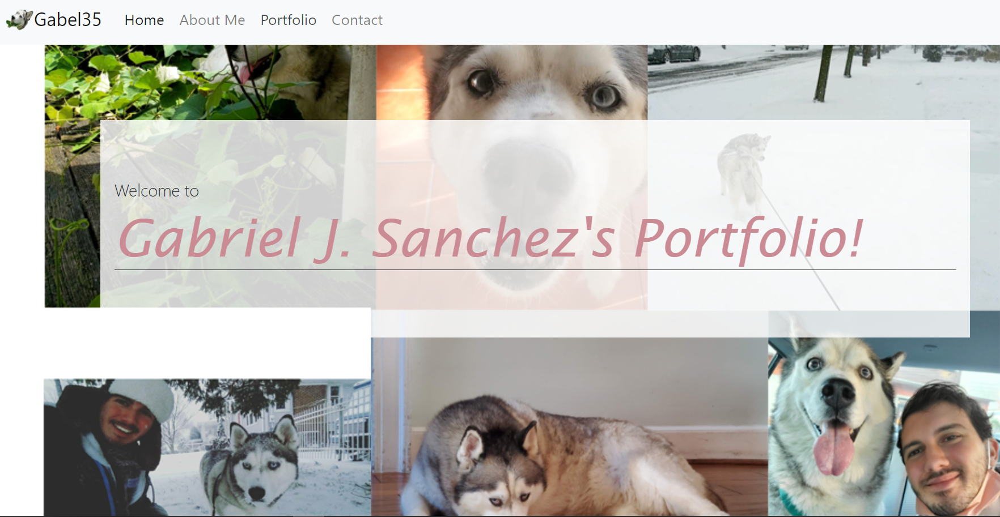

# Gabel35's Responsive Portfolio

## Description 

A multi-page website acting as a portfolio, containing biographical information, pictures, and created content of the user (me). Included is a front page and a method for contacting the creator.
Currently a template with a few projects. 

Last Updated in January, 2021

## Table of Contents

If your README is very long, add a table of contents to make it easy for users to find what they need.

* [Installation](#installation)
* [Usage](#usage)
* [Credits](#credits)
* [License](#license)

## Installation

N/A

## Usage 

This website is to act as a portfolio to store information and projects for the user Gabriel J. Sanchez, a.k.a gabel35.

Please follow the following link to the portfolio!
!(https://gabel35.github.io/)

## Credits

The TA's at BCS  

Template photos and the background photo were found through pixabay.com and pexels.com

## License

N/A for now

-------------

Thank you!